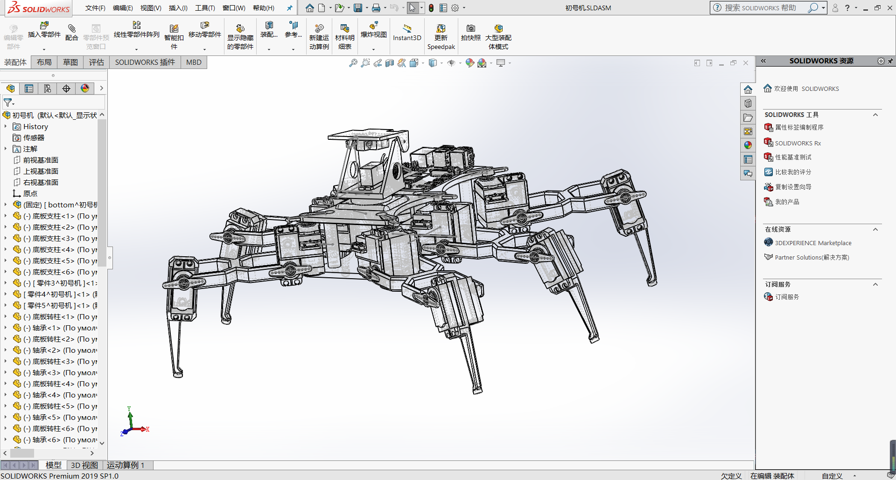
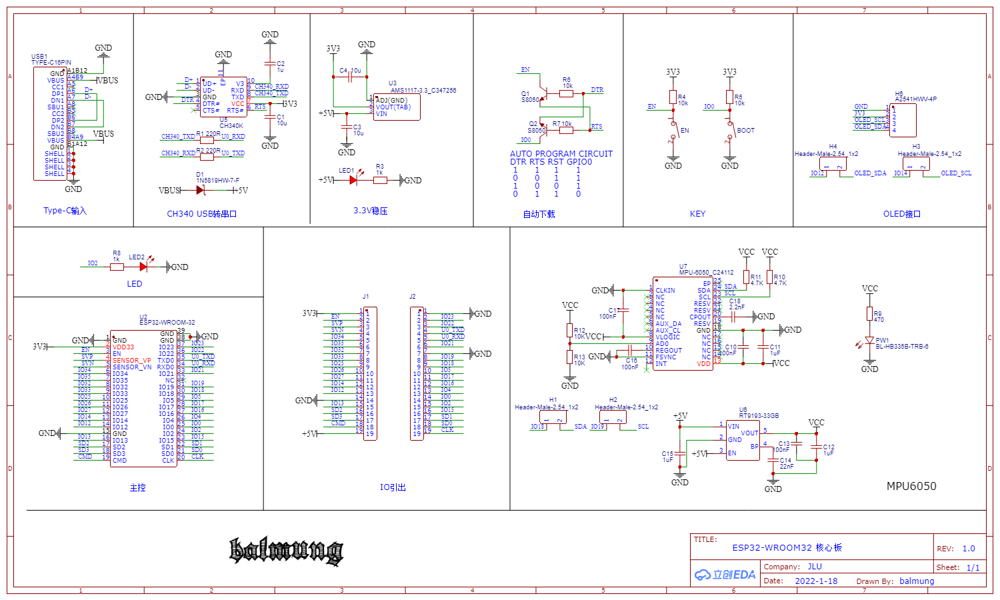
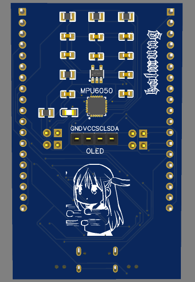
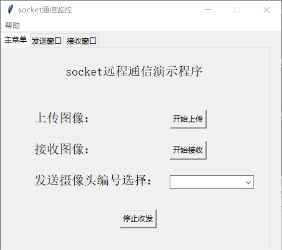

# 基于树莓派的六足机器人方案设计
## 工程内容说明
### hardware为项目相关硬件设计

 * 机械结构为六足机器人的3d建模工程，包括本体和云台 
 *  遥控器在ESP32最小开发板上集成了MPU6050和OLED接口并设计了使能引脚，可以选择是否收发外设数据
 文件包括PCB的立创EDA文件、Altium文件与3d模型 
### code文件夹内为使用到的各种代码

 * 包括pc控制的上位机和图传程序及其服务器程序、体感遥控器的驱动程序和树莓派部分执行程序
 * 遥控器代码和说明来自stratosphericus(Github)
### resource文件夹为项目相关的资料

 * 包括舵机控制板的串口控制指令说明以及运动控制理论及相关资料
 * 详细运控资料来自Panzer-Crow(Github)整理
### software为使用到的软件内容

 * 舵机控制板的图形化编程上位机以及可能使用到的串口驱动
## 简单预览

 
 

! 

## 参考与致谢

> 本说明来自balmung08(Github) 
> 此项目在设计中参考了https://grabcad.com/library/spider-robot-v2-0-mg995-servo-quadruped-on-stm32f103-1
感谢这帮俄国佬 
另外，立创EDA永远的神，我认为大家都应该试一试.jpg

>因为马上就要考研了，我们没有时间将设计做成实物，但是在设计过程中仍旧有很大收获 
感谢愿意陪着我一起抽风做这玩意的两位队友: stratosphericus,Panzer-Crow
